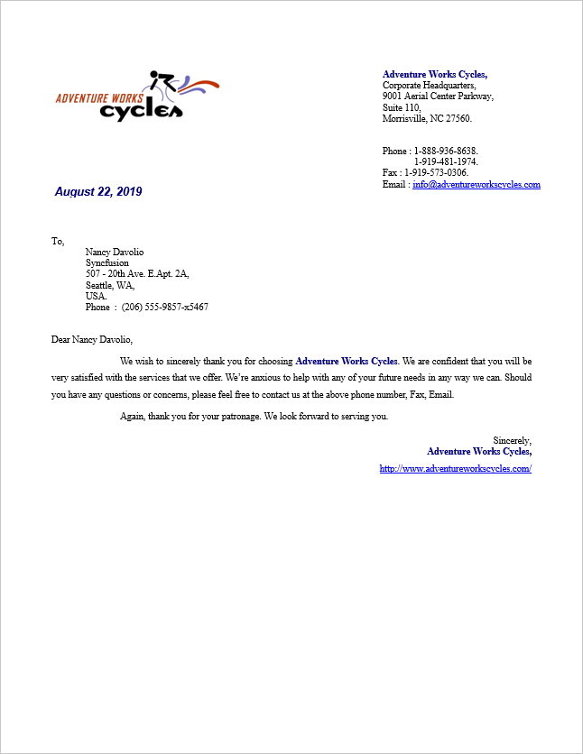
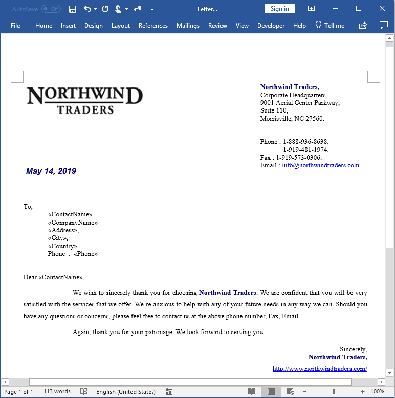

# Create personalized letters

This example illustrates how to personalize letters using an array of field names with its values as data source by using the [Execute(string[] fieldNames, string[] fieldValues)](https://help.syncfusion.com/cr/cref_files/file-formats/Syncfusion.DocIO.Base~Syncfusion.DocIO.DLS.MailMerge~Execute(String[],String[]).html) API.

# How to run the project

1. Download this project to a location in your disk.

2. Open the solution file using Visual Studio.

3. Rebuild the solution to install the required NuGet packages.

4. Run the application.

# Screenshots

By running this application, you will get a personalized letter as follows.

To personalize letters, design your Word document template with the required content and merge fields using Microsoft Word as follows.

Take a moment to peruse the [documentation](https://help.syncfusion.com/file-formats/docio/getting-started), where you will find other Word document processing operations along with features like [mail merge](https://help.syncfusion.com/file-formats/docio/working-with-mailmerge), [merge](https://help.syncfusion.com/file-formats/docio/working-with-word-document#merging-word-documents), and split documents, [find and replace](https://help.syncfusion.com/file-formats/docio/working-with-find-and-replace) text in the Word document, [protect](https://help.syncfusion.com/file-formats/docio/working-with-security) Word documents, and most importantly [PDF](https://help.syncfusion.com/file-formats/docio/word-to-pdf) and [image](https://help.syncfusion.com/file-formats/docio/word-to-image) conversions with code examples.