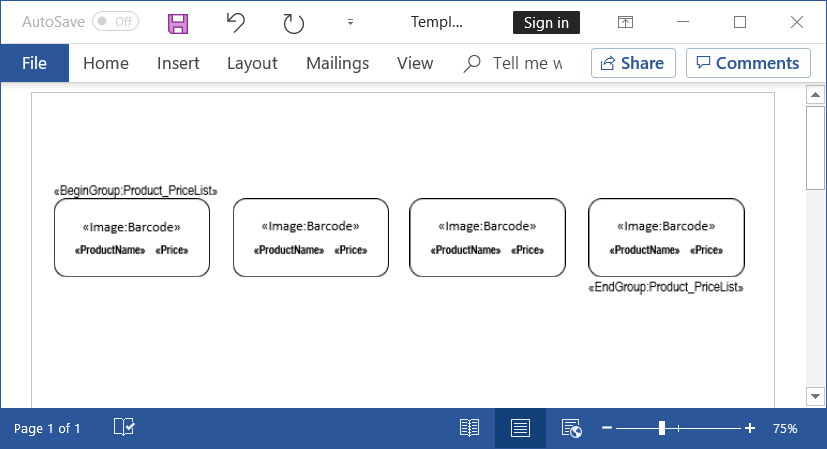

# Generate barcode labels in C#

This example shows how to generate a barcode using [Syncfusion PDF library](https://www.syncfusion.com/pdf-framework/net/pdf-library?utm_source=github&utm_medium=listing&utm_campaign=mail-merge-examples) and insert the generated barcode as an image into the Word document with [MergeImageField](https://help.syncfusion.com/cr/file-formats/Syncfusion.DocIO.Base~Syncfusion.DocIO.DLS.MailMerge~MergeImageField_EV.html) event using [Syncfusion Word library](https://www.syncfusion.com/word-framework/net/word-library?utm_source=github&utm_medium=listing&utm_campaign=mail-merge-examples) (Essential DocIO).

# How to run the project

1. Download this project to a location in your disk.

2. Open the solution file using Visual Studio.

3. Rebuild the solution to install the required NuGet packages.

4. Run the application.

# Screenshots

By running this application, you will get the barcode labels as follows.

To generate barcode labels, design your template Word document with the required layout, formatting, graphics, and merge fields using Microsoft Word as follows.

**Note:** In this Word template document, [NEXT](https://support.office.com/en-us/article/field-codes-next-field-3862fad6-0297-411a-a4e7-6ff5bcf178fd?ui=en-US&rs=en-US&ad=US) field is inserted at end of each cell and this field instructs to merge the next record from the data source. You can view the NEXT field by opening this template document in Microsoft Word application and press Alt+F9 shortcut key to toggle field codes.

Take a moment to peruse the [documentation](https://help.syncfusion.com/file-formats/docio/getting-started), where you will find other Word document processing operations along with features like [mail merge](https://help.syncfusion.com/file-formats/docio/working-with-mail-merge), [merge](https://help.syncfusion.com/file-formats/docio/working-with-word-document#merging-word-documents), and split documents, [find and replace](https://help.syncfusion.com/file-formats/docio/working-with-find-and-replace) text in the Word document, [protect](https://help.syncfusion.com/file-formats/docio/working-with-security) Word documents, and most importantly [PDF](https://help.syncfusion.com/file-formats/docio/word-to-pdf) and [image](https://help.syncfusion.com/file-formats/docio/word-to-image) conversions with code examples.