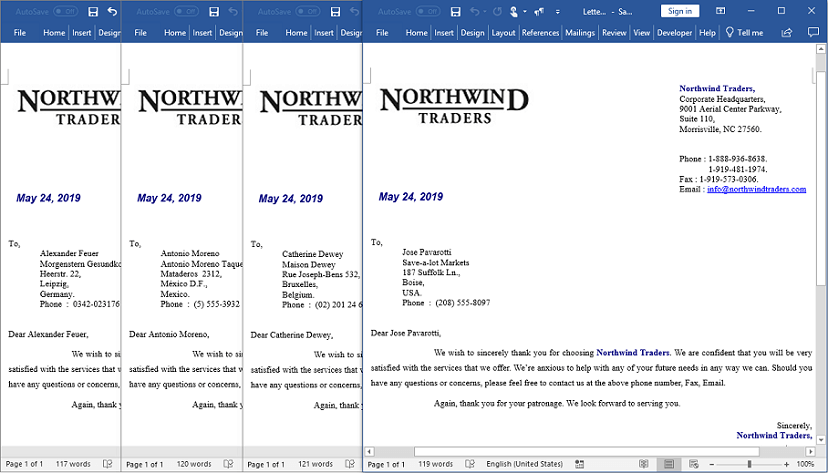
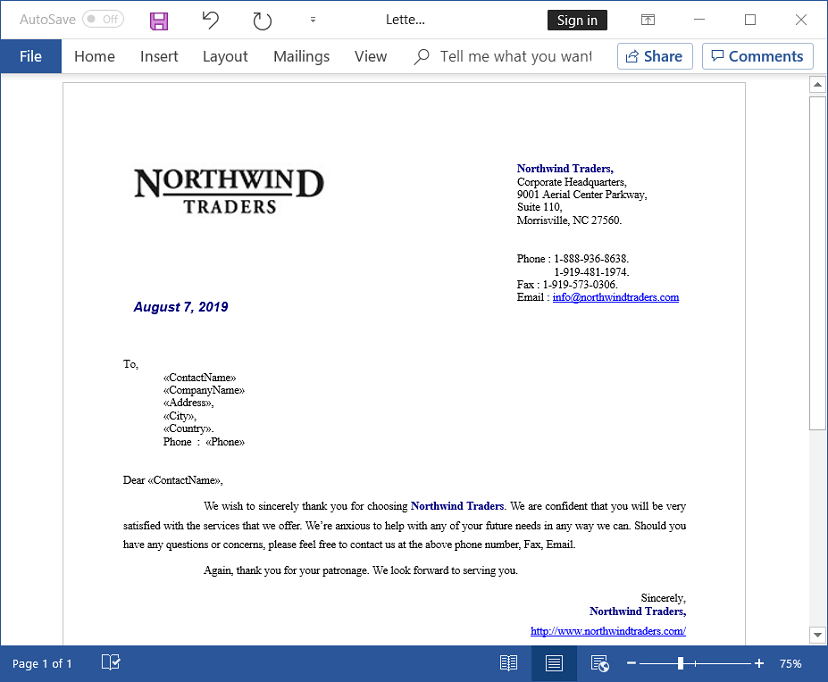

# Generate multiple Word documents in C#

This example shows how to generate multiple Word documents for each record in [DataTable](https://docs.microsoft.com/en-us/dotnet/api/system.data.datatable?view=netframework-4.8) using the [Execute(DataRow row)](https://help.syncfusion.com/cr/cref_files/file-formats/Syncfusion.DocIO.Base~Syncfusion.DocIO.DLS.MailMerge~Execute(DataRow).html) API.

# How to run the project

1. Download this project to a location in your disk.

2. Open the solution file using Visual Studio.

3. Rebuild the solution to install the required NuGet packages.

4. Run the application.

# Screenshots

By running this application, you will get multiple Word documents as follows.

To generate multiple Word documents, design your template Word document with the required content and merge fields using Microsoft Word as follows.

 

Take a moment to peruse the [documentation](https://help.syncfusion.com/file-formats/docio/getting-started), where you will find other Word document processing operations along with features like [mail merge](https://help.syncfusion.com/file-formats/docio/working-with-mail-merge), [merge](https://help.syncfusion.com/file-formats/docio/working-with-word-document#merging-word-documents), and split documents, [find and replace](https://help.syncfusion.com/file-formats/docio/working-with-find-and-replace) text in the Word document, [protect](https://help.syncfusion.com/file-formats/docio/working-with-security) Word documents, and most importantly [PDF](https://help.syncfusion.com/file-formats/docio/word-to-pdf) and [image](https://help.syncfusion.com/file-formats/docio/word-to-image) conversions with code examples.