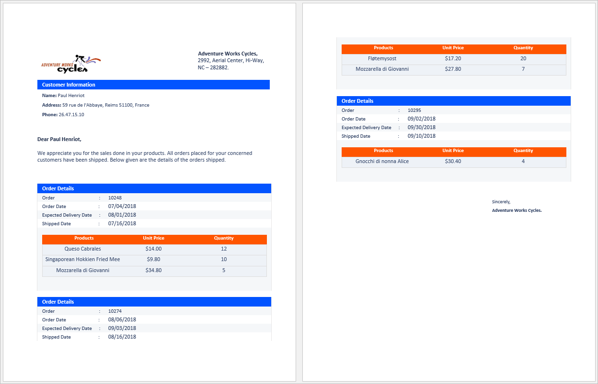
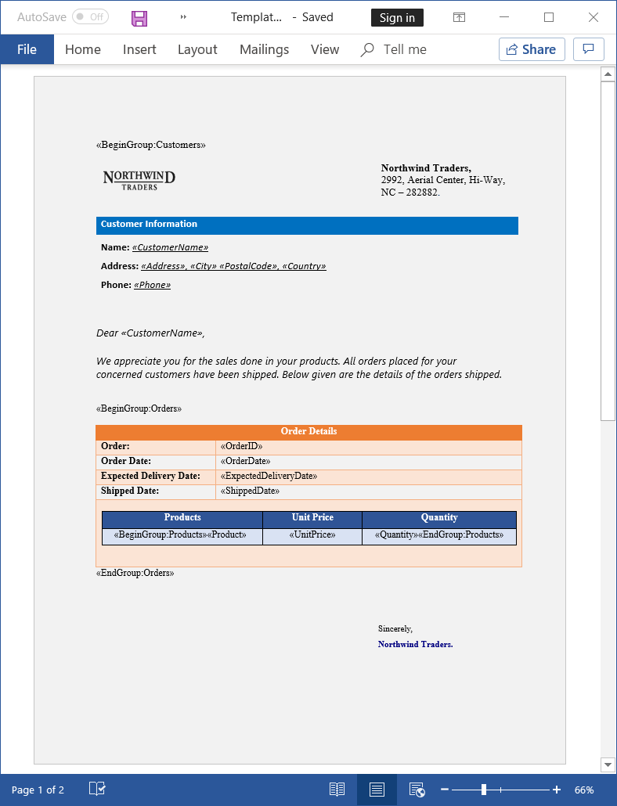

# Generate order details of customer

This example illustrates how to generate order details of each customer by performing nested mail merge operation for a specified region using [MailMergeDataTable](https://help.syncfusion.com/cr/file-formats/Syncfusion.DocIO.Base~Syncfusion.DocIO.DLS.MailMergeDataTable.html) as the data source by [ExecuteNestedGroup(MailMergeDataTable dataTable)](https://help.syncfusion.com/cr/file-formats/Syncfusion.DocIO.Base~Syncfusion.DocIO.DLS.MailMerge~ExecuteNestedGroup(MailMergeDataTable).html) API.

# How to run the project

1. Download this project to a location in your disk.

2. Open the solution file using Visual Studio.

3. Rebuild the solution to install the required NuGet packages.

4. Run the application.

# Screenshots

By running this application, you will get the order details in a Word document as follows.

To create order details by nested mail merge operation, design your Word document template with the nested group merge fields using Microsoft Word. In the below template, Customers is the owner group and it has two child groups, Orders and Products.

Take a moment to peruse the [documentation](https://help.syncfusion.com/file-formats/docio/getting-started), where you will find other Word document processing operations along with features like [mail merge](https://help.syncfusion.com/file-formats/docio/working-with-mailmerge), [merge](https://help.syncfusion.com/file-formats/docio/working-with-word-document#merging-word-documents), and split documents, [find and replace](https://help.syncfusion.com/file-formats/docio/working-with-find-and-replace) text in the Word document, [protect](https://help.syncfusion.com/file-formats/docio/working-with-security) Word documents, and most importantly [PDF](https://help.syncfusion.com/file-formats/docio/word-to-pdf) and [image](https://help.syncfusion.com/file-formats/docio/word-to-image) conversions with code examples.