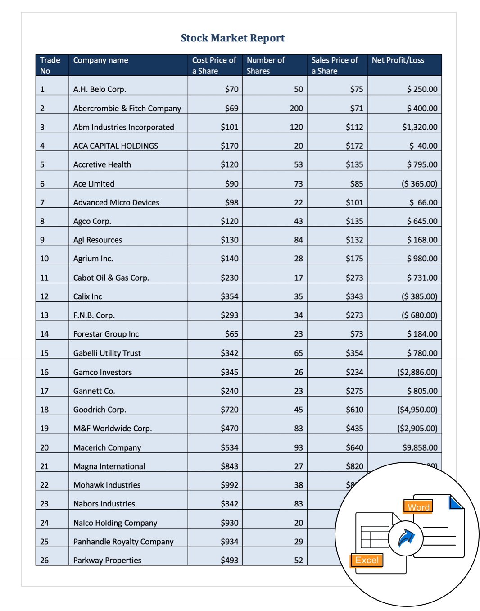
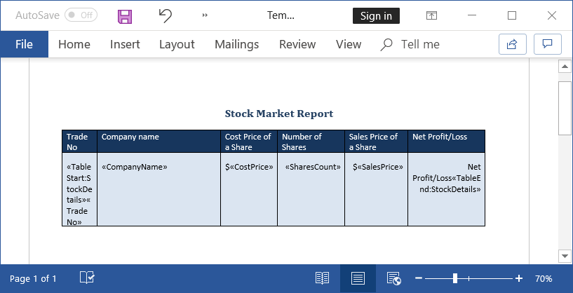

# Group mail merge using Excel in C#

This example illustrates how to import data from Excel Spreadsheet using [Syncfusion&reg; Excel library](https://www.syncfusion.com/excel-framework/net/excel-library?utm_source=github&utm_medium=listing&utm_campaign=mail-merge-examples) (Essential&reg; XlsIO) and use that data for mail merge in the Word document using [Syncfusion&reg; Word library](https://www.syncfusion.com/word-framework/net/word-library?utm_source=github&utm_medium=listing&utm_campaign=mail-merge-examples) (Essential&reg; DocIO).

# How to run the project

1. Download this project to a location in your disk.

2. Open the solution file using Visual Studio.

3. Rebuild the solution to install the required NuGet packages.

4. Run the application.

# Screenshots

By running this application, you will get the stock market report as follows.

To generate reports in a Word document, design your template Word document with the required layout, formatting, graphics, and merge fields using Microsoft Word as follows.

Take a moment to peruse the [documentation](https://help.syncfusion.com/file-formats/docio/getting-started), where you will find other Word document processing operations along with features like [mail merge](https://help.syncfusion.com/file-formats/docio/working-with-mail-merge), [merge](https://help.syncfusion.com/file-formats/docio/working-with-word-document#merging-word-documents), and split documents, [find and replace](https://help.syncfusion.com/file-formats/docio/working-with-find-and-replace) text in the Word document, [protect](https://help.syncfusion.com/file-formats/docio/working-with-security) Word documents, and most importantly [PDF](https://help.syncfusion.com/file-formats/docio/word-to-pdf) and [image](https://help.syncfusion.com/file-formats/docio/word-to-image) conversions with code examples.
