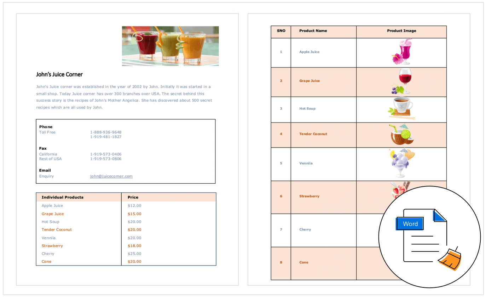
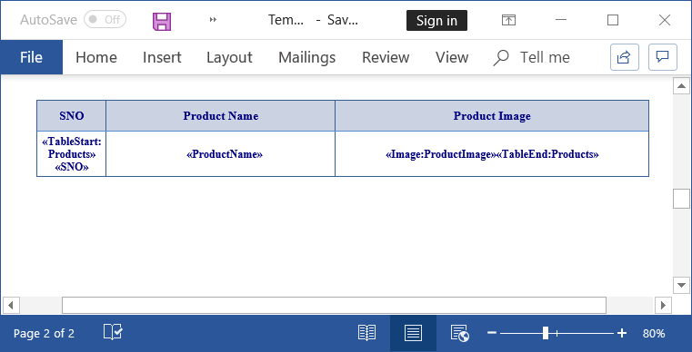

# Product catalog in C#

This example illustrates how to generate a product catalog by performing mail merge in the Word document with formatting the merged text using the [MergeField](https://help.syncfusion.com/cr/document-processing/Syncfusion.DocIO.DLS.MergeFieldEventHandler.html) event and update the image using [MergeImageField](https://help.syncfusion.com/cr/document-processing/Syncfusion.DocIO.DLS.MergeImageFieldEventHandler.html) event.

# How to run the project

1. Download this project to a location in your disk.

2. Open the solution file using Visual Studio.

3. Rebuild the solution to install the required NuGet packages.

4. Run the application.

# Screenshots

By running this application, you will get the product catalog as follows.

To generate product catalog, design your template Word document with the required layout, formatting, graphics, and merge fields using Microsoft Word as follows.

Take a moment to peruse the [documentation](https://help.syncfusion.com/document-processing/word/word-library/net/getting-started), where you will find other Word document processing operations along with features like [mail merge](https://www.syncfusion.com/document-sdk/net-word-library/mail-merge), [merge](https://www.syncfusion.com/document-sdk/net-word-library/merge-word-documents), and split documents, [find and replace](https://www.syncfusion.com/document-sdk/net-word-library/find-and-replace) text in the Word document, [protect](https://help.syncfusion.com/document-processing/word/word-library/net/working-with-security) Word documents, and most importantly [PDF](https://www.syncfusion.com/document-sdk/net-word-library/word-to-pdf-conversion) and [image](https://www.syncfusion.com/document-sdk/net-word-library/word-to-image-conversion) conversions with code examples.
