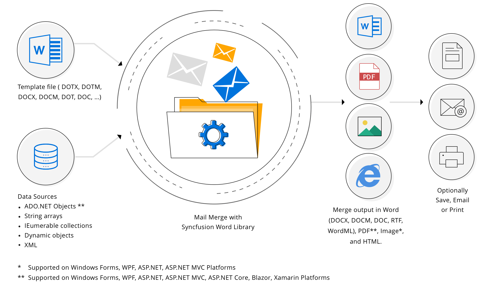
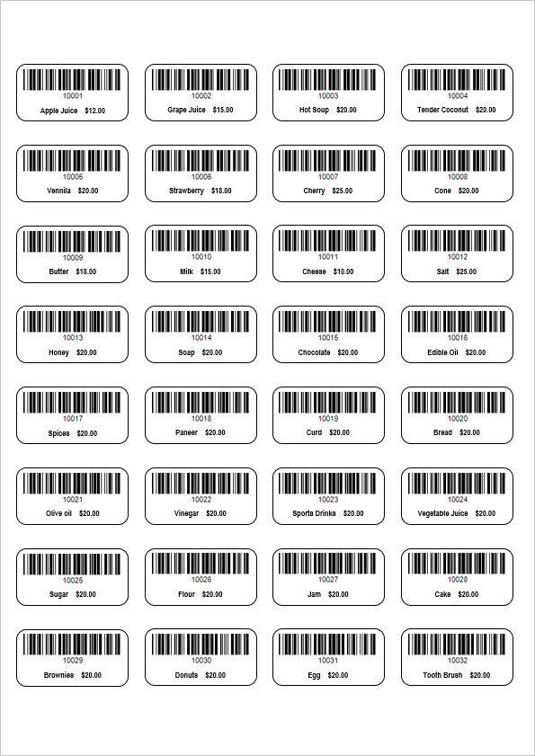
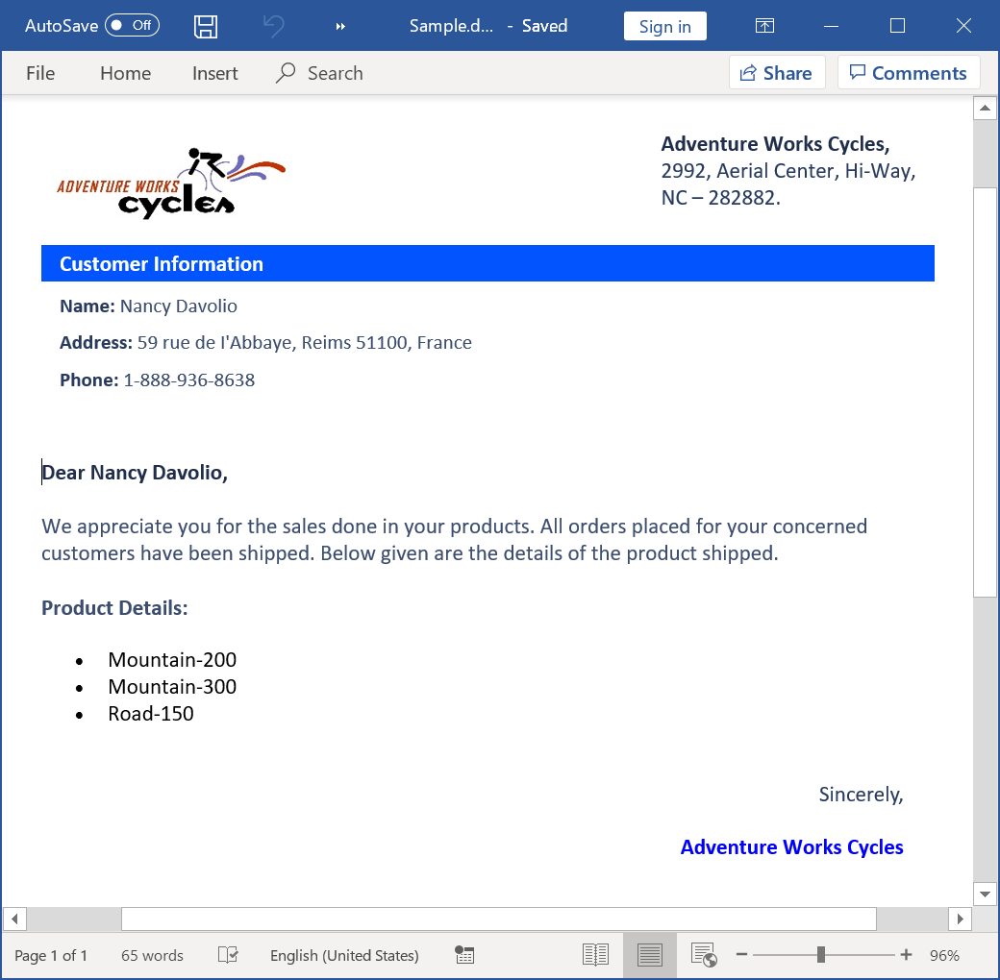
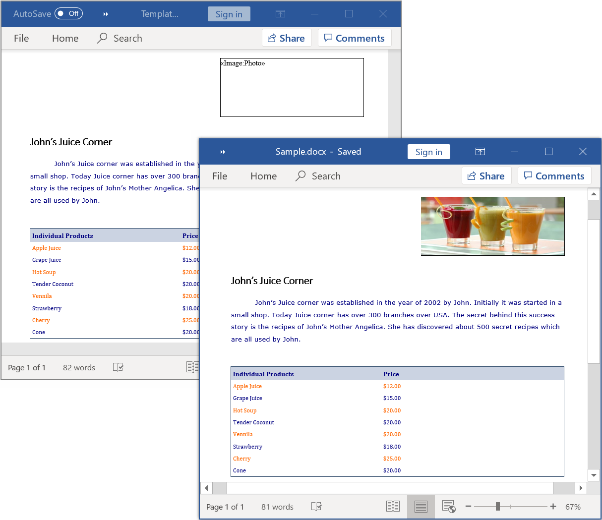
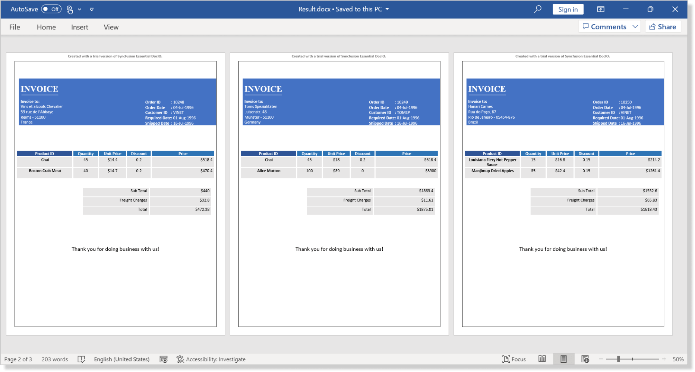

# Mail merge Examples

This repository contains examples that illustrates how to mail merge Word documents in C# and VB.NET using Syncfusion’s [.NET Word library](https://www.syncfusion.com/word-framework/net/word-library?utm_source=github&utm_medium=listing&utm_campaign=github-docio-examples) (Essential&reg; DocIO) without Microsoft Word or Office interop dependencies.

# Mail merge in Word documents

Mail merge is a process of merging data (replacing merge fields) from a data source into the template Word document.

The Syncfusion&reg; [Word library](https://www.syncfusion.com/word-framework/net/word-library?utm_source=github&utm_medium=listing&utm_campaign=github-github-docio-examples) (Essential&reg; DocIO) has a powerful [mail merge](https://www.syncfusion.com/word-framework/net/word-library/mail-merge?utm_source=github&utm_medium=listing&utm_campaign=github-docio-examples) API to generate personalized reports like letters, pre-addressed envelopes, address labels, invoice, payroll, and more. It performs mail merge faster in a batch process without Microsoft Word or Office interop dependencies. The generated reports can be saved as a Word document, PDF, image, HTML, and more.

 
 

# Key Features

- [Envelopes for mailing in C#](Create-Envelopes-for-mailing/) - Create envelopes for mailings to the list of recipients.

- [Generate multiple Word documents in C#](Generate-multiple-Word-documents/) - Create a batch of personalized letters as individual document for each record.

- [Create and send email messages in C#](Create-and-send-email-messages/) - Create and send email messages by converting merged document to HTML.

- [Personalized letters in C#](Create-personalized-letter/) - Create personalized letters for selected recipient from the mailing list.

- [Order details of a customer in C#](Generate-order-details-of-customer/) - Generate order details of a customer using nested mail merge.

- [Barcode labels in C#](Generate-Barcode-labels/) - Generate a barcode labels for grocery store.

- [Mail merge using Excel Spreadsheet in C#](Group-Mail-merge-using-Excel/) - Import data from Excel Spreadsheet and generate a report.

- [Product catalog in C#](Product-catalog/) - Generate a product catalog and formatting the merged text.

- [Replace merge field with HTML in C#](Replace-Merge-field-with-HTML/) - Replace merge field with HTML string using mail merge.

- [Fit the photo within text box in C#](Fit-photo-within-textbox/) - Fit the photo within the text box in the Word document using mail merge.

- [Start each record on a new page in C#](Start-each-record-on-new-page/) - Generate each record in new page while executing group mail merge.

# Screenshots

**Envelopes for mailing**

 
 

**Batch of personalized letters**

 
 

**Barcode labels**

 
 

**Replace merge field with HTML**

 
 

**Fit photo within text box**

 
 

**Start each record on a new page**

 
 

## Syncfusion&reg; .NET Word Library
The Syncfusion&reg; DocIO is a [.NET Word library](https://www.syncfusion.com/document-processing/word-framework/net/word-library?utm_source=github&utm_medium=listing&utm_campaign=github-github-docio-examples) allows you to add advanced Word document processing functionalities to any .NET application and does not require Microsoft Word application to be installed in the machine. It is a non-UI component that provides a full-fledged document instance model similar to the Microsoft Office COM libraries to iterate with the document elements explicitly and perform necessary manipulation. 

Take a moment to peruse the [documentation](https://help.syncfusion.com/file-formats/docio/getting-started?utm_source=github&utm_medium=listing&utm_campaign=github-github-docio-examples), where you can find basic Word document processing options along with the features like [mail merge](https://help.syncfusion.com/file-formats/docio/working-with-mail-merge?utm_source=github&utm_medium=listing&utm_campaign=github-github-docio-examples), [merge](https://help.syncfusion.com/file-formats/docio/word-document/merging-word-documents?utm_source=github&utm_medium=listing&utm_campaign=github-github-docio-examples), [split](https://help.syncfusion.com/file-formats/docio/word-document/split-word-documents?utm_source=github&utm_medium=listing&utm_campaign=github-github-docio-examples) and [compare documents](https://help.syncfusion.com/file-formats/docio/word-document/compare-word-documents?utm_source=github&utm_medium=listing&utm_campaign=github-github-docio-examples), [find and replace](https://help.syncfusion.com/file-formats/docio/working-with-find-and-replace?utm_source=github&utm_medium=listing&utm_campaign=github-github-docio-examples) text in the Word document, [protect](https://help.syncfusion.com/file-formats/docio/working-with-security?utm_source=github&utm_medium=listing&utm_campaign=github-github-docio-examples) the Word documents, and most importantly, the [PDF](https://help.syncfusion.com/file-formats/docio/word-to-pdf?utm_source=github&utm_medium=listing&utm_campaign=github-github-docio-examples) and [Image](https://help.syncfusion.com/file-formats/docio/word-to-image?utm_source=github&utm_medium=listing&utm_campaign=github-github-docio-examples) conversions with code examples.

Compatible Microsoft Word Versions
----------------------------------

*   Microsoft Word 97-2003
*   Microsoft Word 2007
*   Microsoft Word 2010
*   Microsoft Word 2013
*   Microsoft Word 2016
*   Microsoft Word 2019
*   Microsoft 365

Supported File Formats
----------------------

*   Creates, reads, and edits popular text file formats like [DOC](https://help.syncfusion.com/file-formats/docio/word-file-formats?utm_source=github&utm_medium=listing&utm_campaign=github-github-docio-examples#doc-to-docx-and-docx-to-doc), DOT, [DOCM](https://help.syncfusion.com/file-formats/docio/word-file-formats?utm_source=github&utm_medium=listing&utm_campaign=github-github-docio-examples#macros), DOTM, [DOCX](https://help.syncfusion.com/file-formats/docio/word-file-formats?utm_source=github&utm_medium=listing&utm_campaign=github-github-docio-examples#doc-to-docx-and-docx-to-doc), [DOTX](https://help.syncfusion.com/file-formats/docio/word-file-formats?utm_source=github&utm_medium=listing&utm_campaign=github-github-docio-examples#templates), [HTML](https://help.syncfusion.com/file-formats/docio/html?utm_source=github&utm_medium=listing&utm_campaign=github-github-docio-examples), [RTF](https://help.syncfusion.com/file-formats/docio/rtf?utm_source=github&utm_medium=listing&utm_campaign=github-github-docio-examples), [TXT](https://help.syncfusion.com/file-formats/docio/text?utm_source=github&utm_medium=listing&utm_campaign=github-github-docio-examples), and [XML (WordML)](https://help.syncfusion.com/file-formats/docio/word-file-formats#word-processing-xml-xml?utm_source=github&utm_medium=listing&utm_campaign=github-github-docio-examples).
*   Converts Word documents also to [PDF](https://help.syncfusion.com/file-formats/docio/word-to-pdf?utm_source=github&utm_medium=listing&utm_campaign=github-github-docio-examples), [Image](https://help.syncfusion.com/file-formats/docio/word-to-image?utm_source=github&utm_medium=listing&utm_campaign=github-github-docio-examples), and [ODT](https://help.syncfusion.com/file-formats/docio/word-to-odt?utm_source=github&utm_medium=listing&utm_campaign=github-github-docio-examples) files.

## How to run the examples
- Download this project to a location in your disk.
- Open the solution file using Visual Studio.
- Rebuild the solution to install the required NuGet packages.
- Run the application.

## Resources

- **Product page:** [Syncfusion&reg; Word Framework](https://www.syncfusion.com/document-processing/word-framework/net?utm_source=github&utm_medium=listing&utm_campaign=github-github-docio-examples)
- **Documentation:** [Mail merge using Syncfusion&reg; Word library](https://help.syncfusion.com/file-formats/docio/working-with-mail-merge?utm_source=github&utm_medium=listing&utm_campaign=github-github-docio-examples)
- **GitHub Examples:** [Syncfusion&reg; Word library examples](https://github.com/SyncfusionExamples/DocIO-Examples?utm_source=github&utm_medium=listing&utm_campaign=github-github-docio-examples)
- **Online demo:** [Syncfusion&reg; Word library - Online demos](https://ej2.syncfusion.com/aspnetcore/DocIO/SalesInvoice?utm_source=github&utm_medium=listing&utm_campaign=github-github-docio-examples)

## Support and feedback
For any other queries, reach our [Syncfusion&reg; support team](https://support.syncfusion.com/?utm_source=github&utm_medium=listing&utm_campaign=github-github-docio-examples) or post the queries through the [community forums](https://www.syncfusion.com/forums?utm_source=github&utm_medium=listing&utm_campaign=github-github-docio-examples).

Request new feature through [Syncfusion&reg; feedback portal](https://www.syncfusion.com/feedback?utm_source=github&utm_medium=listing&utm_campaign=github-github-docio-examples).

## License
This is a commercial product and requires a paid license for possession or use. Syncfusion's licensed software, including this component, is subject to the terms and conditions of [Syncfusion's EULA](https://www.syncfusion.com/license/studio/22.2.5/syncfusion_essential_studio_eula.pdf?utm_source=github&utm_medium=listing&utm_campaign=github-github-docio-examples). You can purchase a licnense [here](https://www.syncfusion.com/sales/products?utm_source=github&utm_medium=listing&utm_campaign=github-github-docio-examples) or start a free 30-day trial [here](https://www.syncfusion.com/account/manage-trials/start-trials?utm_source=github&utm_medium=listing&utm_campaign=github-github-docio-examples).