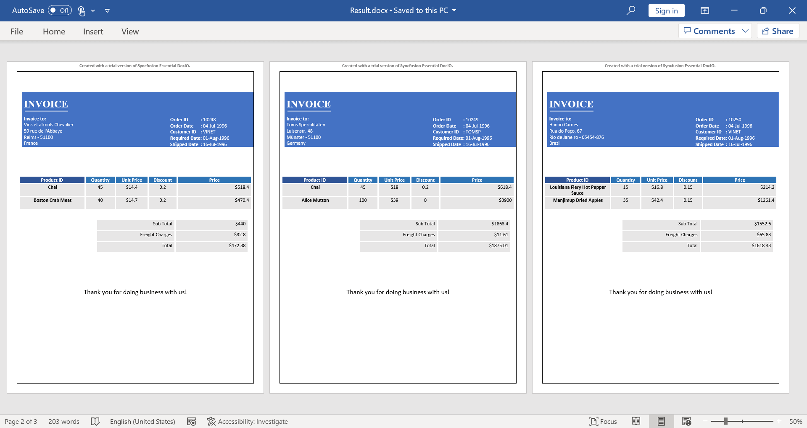

# Mail merge Examples

This repository contains examples that illustrates how to mail merge Word documents in C# and VB.NET using Syncfusion’s [.NET Word library](https://www.syncfusion.com/word-framework/net/word-library?utm_source=github&utm_medium=listing&utm_campaign=mail-merge-examples) (Essential DocIO) without Microsoft Word or Office interop dependencies.

# Mail merge in Word documents

Mail merge is a process of merging data (replacing merge fields) from a data source into the template Word document.

The Syncfusion [Word library](https://www.syncfusion.com/word-framework/net/word-library?utm_source=github&utm_medium=listing&utm_campaign=mail-merge-examples) (Essential DocIO) has a powerful [mail merge](https://www.syncfusion.com/word-framework/net/word-library/mail-merge?utm_source=github&utm_medium=listing&utm_campaign=mail-merge-examples) API to generate personalized reports like letters, pre-addressed envelopes, address labels, invoice, payroll, and more. It performs mail merge faster in a batch process without Microsoft Word or Office interop dependencies. The generated reports can be saved as a Word document, PDF, image, HTML, and more.

 
 

# NuGet packages

NuGet is the one of the easiest ways to download and install Syncfusion [Word library](https://www.syncfusion.com/word-framework/net/word-library?utm_source=github&utm_medium=listing&utm_campaign=mail-merge-examples) (Essential DocIO) to read, write, and edit Word documents. The following NuGet packages need to be installed in your application.

|Platform(s)|Package name|
|-----------|------------|
|Windows Forms|[Syncfusion.DocIO.WinForms.nupkg](https://www.nuget.org/packages/Syncfusion.DocIO.WinForms/)|
|WPF|[Syncfusion.DocIO.Wpf.nupkg](https://www.nuget.org/packages/Syncfusion.DocIO.Wpf/)|
|ASP.NET |[Syncfusion.DocIO.AspNet.nupkg](https://www.nuget.org/packages/Syncfusion.DocIO.AspNet/)|
|ASP.NET MVC4|[Syncfusion.DocIO.AspNet.Mvc4.nupkg](https://www.nuget.org/packages/Syncfusion.DocIO.AspNet.Mvc4/)|
|ASP.NET MVC5|[Syncfusion.DocIO.AspNet.Mvc5.nupkg](https://www.nuget.org/packages/Syncfusion.DocIO.AspNet.Mvc5/)|
|ASP.NET Core and Blazor|[Syncfusion.DocIO.Net.Core.nupkg](https://www.nuget.org/packages/Syncfusion.DocIO.Net.Core/)|
|Xamarin|[Syncfusion.Xamarin.DocIO.nupkg](https://www.nuget.org/packages/Syncfusion.Xamarin.DocIO/)|
|UWP|[Syncfusion.DocIO.UWP.nupkg](https://www.nuget.org/packages/Syncfusion.DocIO.UWP/)|

# Key Features

- [Envelopes for mailing in C#](Create-Envelopes-for-mailing/) - Create envelopes for mailings to the list of recipients.

- [Generate multiple Word documents in C#](Generate-multiple-Word-documents/) - Create a batch of personalized letters as individual document for each record.

- [Create and send email messages in C#](Create-and-send-email-messages/) - Create and send email messages by converting merged document to HTML.

- [Personalized letters in C#](Create-personalized-letter/) - Create personalized letters for selected recipient from the mailing list.

- [Order details of a customer in C#](Generate-order-details-of-customer/) - Generate order details of a customer using nested mail merge.

- [Barcode labels in C#](Generate-Barcode-labels/) - Generate a barcode labels for grocery store.

- [Mail merge using Excel Spreadsheet in C#](Group-Mail-merge-using-Excel/) - Import data from Excel Spreadsheet and generate a report.

- [Product catalog in C#](Product-catalog/) - Generate a product catalog and formatting the merged text.

- [Replace merge field with HTML in C#](Replace-Merge-field-with-HTML/) - Replace merge field with HTML string using mail merge.

- [Fit the photo within text box in C#](Fit-photo-within-textbox/) - Fit the photo within the text box in the Word document using mail merge.

- [Start at new page in C#](Start-at-new-page/) - Generate records in each page during mail merge.

# Screenshots

**Envelopes for mailing**

 
 

**Batch of personalized letters**

 
 

**Barcode labels**

 
 

**Replace merge field with HTML**

 
 

**Fit photo within text box**

 
 

**Start at new page**

 
 

# Resources

- **Product page:** [Syncfusion Word Framework](https://www.syncfusion.com/word-framework/net?utm_source=github&utm_medium=listing&utm_campaign=mail-merge-examples)

- **Documentation:** [Mail merge using Syncfusion Word library](https://help.syncfusion.com/file-formats/docio/working-with-mail-merge?utm_source=github&utm_medium=listing&utm_campaign=mail-merge-examples)

- **Online demo:** [Essential DocIO-Online demos](https://www.syncfusion.com/demos/fileformats/word-library?utm_source=github&utm_medium=listing&utm_campaign=mail-merge-examples)

- **Download:** [Syncfusion File Formats Controls](https://www.syncfusion.com/sales/products/fileformats?utm_source=github&utm_medium=listing&utm_campaign=mail-merge-examples)

# Support and feedback

* For queries, contact our [Syncfusion support team](https://www.syncfusion.com/support/directtrac/incidents/newincident?utm_source=github&utm_medium=listing&utm_campaign=mail-merge-examples) or post the queries through [community forums](https://www.syncfusion.com/forums?utm_source=github&utm_medium=listing&utm_campaign=mail-merge-examples).

* To renew the subscription, click [here](https://www.syncfusion.com/sales/products?utm_source=github&utm_medium=listing&utm_campaign=mail-merge-examples) or contact our sales team at [salessupport@syncfusion.com](mailto:salessupport@syncfusion.com).

# License

This is a commercial product and requires a paid license for possession or use. Syncfusion’s licensed software, including this component, is subject to the terms and conditions of [Syncfusion's EULA](https://www.syncfusion.com/eula/es?utm_source=github&utm_medium=listing&utm_campaign=mail-merge-examples). You can purchase a license [here](https://www.syncfusion.com/sales/products?utm_source=github&utm_medium=listing&utm_campaign=mail-merge-examples) or start a free 30-day trial [here](https://www.syncfusion.com/account/manage-trials/start-trials?utm_source=github&utm_medium=listing&utm_campaign=mail-merge-examples).
