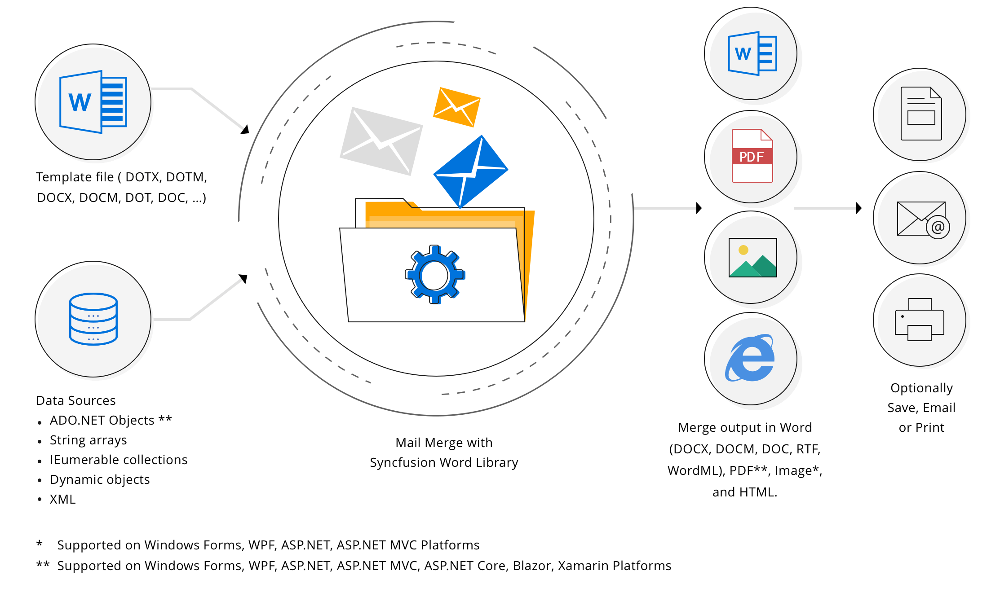
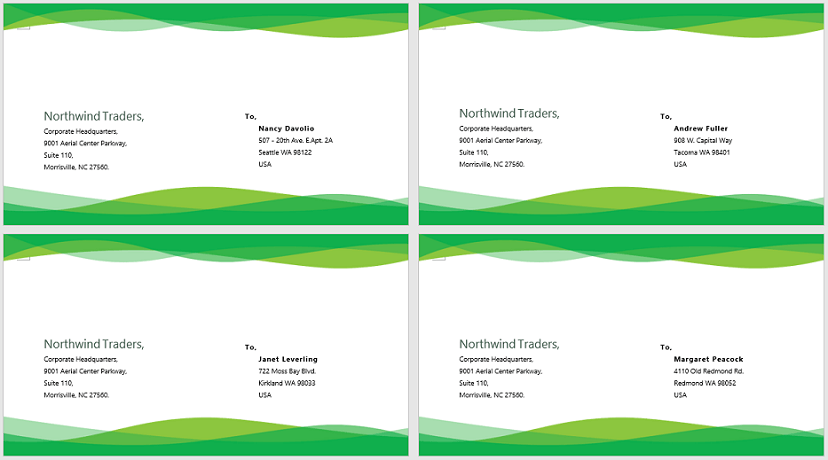
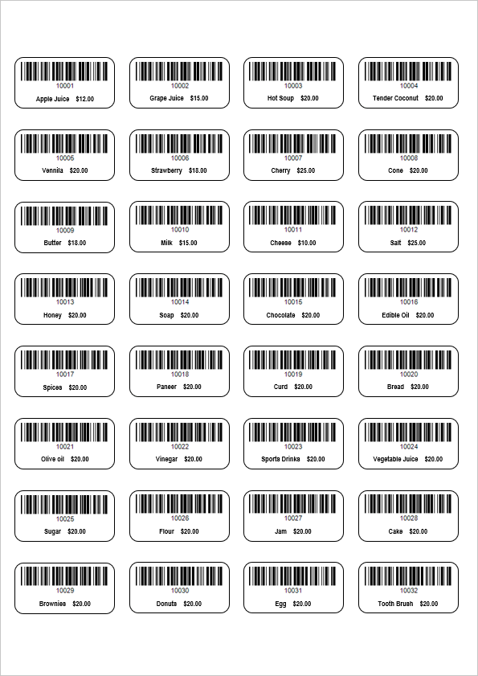
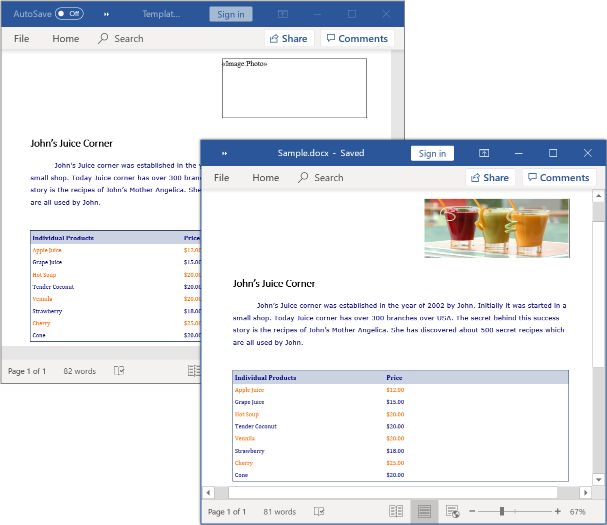
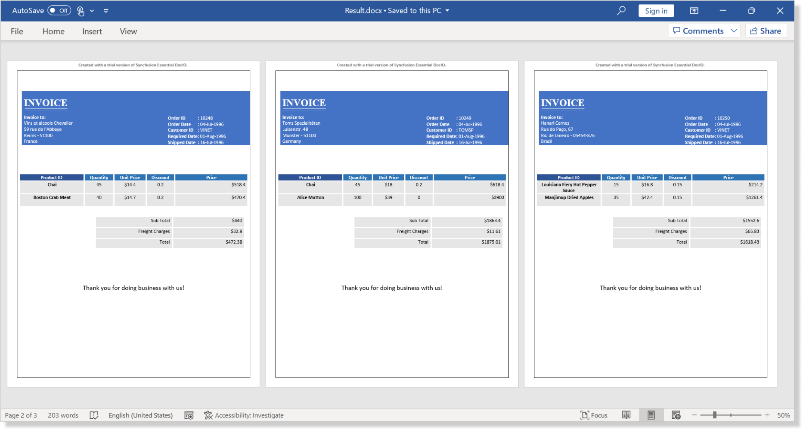

# Mail merge Examples

This repository contains examples that illustrates how to mail merge Word documents in C# and VB.NET using [.NET Word library](https://www.syncfusion.com/document-sdk/net-word-library) (Essential&reg; DocIO) without Microsoft Word or Office interop dependencies.

# Mail merge in Word documents

Mail merge is a process of merging data (replacing merge fields) from a data source into the template Word document.

The [Word library](https://www.syncfusion.com/document-sdk/net-word-library) (Essential&reg; DocIO) has a powerful [mail merge](https://www.syncfusion.com/document-sdk/net-word-library/mail-merge) API to generate personalized reports like letters, pre-addressed envelopes, address labels, invoice, payroll, and more. It performs mail merge faster in a batch process without Microsoft Word or Office interop dependencies. The generated reports can be saved as a Word document, PDF, image, HTML, and more.

 
 

# Key Features

- [Envelopes for mailing in C#](Create-Envelopes-for-mailing/) - Create envelopes for mailings to the list of recipients.

- [Generate multiple Word documents in C#](Generate-multiple-Word-documents/) - Create a batch of personalized letters as individual document for each record.

- [Create and send email messages in C#](Create-and-send-email-messages/) - Create and send email messages by converting merged document to HTML.

- [Personalized letters in C#](Create-personalized-letter/) - Create personalized letters for selected recipient from the mailing list.

- [Order details of a customer in C#](Generate-order-details-of-customer/) - Generate order details of a customer using nested mail merge.

- [Barcode labels in C#](Generate-Barcode-labels/) - Generate a barcode labels for grocery store.

- [Mail merge using Excel Spreadsheet in C#](Group-Mail-merge-using-Excel/) - Import data from Excel Spreadsheet and generate a report.

- [Product catalog in C#](Product-catalog/) - Generate a product catalog and formatting the merged text.

- [Replace merge field with HTML in C#](Replace-Merge-field-with-HTML/) - Replace merge field with HTML string using mail merge.

- [Fit the photo within text box in C#](Fit-photo-within-textbox/) - Fit the photo within the text box in the Word document using mail merge.

- [Start each record on a new page in C#](Start-each-record-on-new-page/) - Generate each record in new page while executing group mail merge.

# Screenshots

**Envelopes for mailing**

 
 

**Batch of personalized letters**

 
 

**Barcode labels**

 
 

**Replace merge field with HTML**

 
 

**Fit photo within text box**

 
 

**Start each record on a new page**

 
 

## .NET Word Library
The Syncfusion&reg; DocIO is a [.NET Word library](https://www.syncfusion.com/document-sdk/net-word-library) allows you to add advanced Word document processing functionalities to any .NET application and does not require Microsoft Word application to be installed in the machine. It is a non-UI component that provides a full-fledged document instance model similar to the Microsoft Office COM libraries to iterate with the document elements explicitly and perform necessary manipulation. 

*   Support to [create Word document](https://www.syncfusion.com/document-sdk/net-word-library/create-word-documents) from scratch.
*   Support to open (read), modify and save existing Word documents.
*   Advanced [Mail merge](https://www.syncfusion.com/document-sdk/net-word-library/mail-merge) support with different data sources.
*   Ability to create or edit Word 97-2003 and later version documents (DOCX), and convert them to commonly used file formats such as [RTF](https://help.syncfusion.com/document-processing/word/conversions/rtf-conversions), [WordML](https://help.syncfusion.com/document-processing/word/conversions/word-file-formats-conversions#word-processing-xml-xml), [TXT](https://www.syncfusion.com/document-sdk/net-word-library/text-conversions), [HTML](https://www.syncfusion.com/document-sdk/net-word-library/html-conversions) and vice versa.
*   Ability to export a Word document as an [Image](https://www.syncfusion.com/document-sdk/net-word-library/word-to-image-conversion) and [PDF](https://www.syncfusion.com/document-sdk/net-word-library/word-to-pdf-conversion)
*   Ability to [merge](https://www.syncfusion.com/document-sdk/net-word-library/merge-word-documents) and [split](https://www.syncfusion.com/document-sdk/net-word-library/split-word-documents) Word documents.
*   Support to [compare](https://www.syncfusion.com/document-sdk/net-word-library/compare-word-documents) two DOCX format documents.
*   Ability to create and manipulate [charts](https://help.syncfusion.com/document-processing/word/word-library/net/working-with-charts), [Shapes](https://help.syncfusion.com/document-processing/word/word-library/net/working-with-shapes), and [Group shape](https://help.syncfusion.com/document-processing/word/word-library/net/working-with-shapes#grouping-shapes) in DOCX and WordML format documents.
*   Ability to read and write [Built-In and Custom Document Properties](https://help.syncfusion.com/document-processing/word/word-library/net/working-with-word-document#working-with-word-document-properties).
*   Ability to [find and replace](https://www.syncfusion.com/document-sdk/net-word-library/find-and-replace) text with its original formatting.
*   Ability to insert [Bookmarks](https://www.syncfusion.com/document-sdk/net-word-library/bookmark-in-word-document) and navigate corresponding bookmarks to insert, replace, and delete content.
*   Support to insert and edit the [form fields](https://www.syncfusion.com/document-sdk/net-word-library/form-filling-in-word-document).
*   Support to protect the document to [restrict access](https://www.syncfusion.com/document-sdk/net-word-library/protect-word-documents) to the elements present within the document.
*   Ability to [encrypt and decrypt](https://help.syncfusion.com/document-processing/word/word-library/net/working-with-security) Word documents.
*   Support to [insert and extract OLE](https://help.syncfusion.com/document-processing/word/word-library/net/working-with-paragraph#working-with-ole-objects) objects.
*   Support to run the DocIO applications in multi-thread and its thread safe.

Compatible Microsoft Word Versions
----------------------------------

*   Microsoft Word 97-2003
*   Microsoft Word 2007
*   Microsoft Word 2010
*   Microsoft Word 2013
*   Microsoft Word 2016
*   Microsoft Word 2019
*   Microsoft 365

Supported File Formats
----------------------

*   Creates, reads, and edits popular text file formats like [DOC](https://help.syncfusion.com/document-processing/word/conversions/word-file-formats-conversions#doc-to-docx-and-docx-to-doc), DOT, [DOCM](https://help.syncfusion.com/document-processing/word/conversions/word-file-formats-conversions#macros-docm-dotm), DOTM, [DOCX](https://help.syncfusion.com/document-processing/word/conversions/word-file-formats-conversions#word-document-docx), [DOTX](https://help.syncfusion.com/document-processing/word/conversions/word-file-formats-conversions#word-template-dotx), [HTML](https://www.syncfusion.com/document-sdk/net-word-library/html-conversions), [RTF](https://help.syncfusion.com/document-processing/word/conversions/rtf-conversions), [TXT](https://www.syncfusion.com/document-sdk/net-word-library/text-conversions), [Markdown](https://help.syncfusion.com/document-processing/word/conversions/markdown-to-word-conversion)and [XML (WordML)](https://help.syncfusion.com/document-processing/word/conversions/word-file-formats-conversions#word-processing-xml-xml).
*   Converts Word documents also to [PDF](https://www.syncfusion.com/document-sdk/net-word-library/word-to-pdf-conversionhub-docio-examples), [Image](https://www.syncfusion.com/document-sdk/net-word-library/word-to-image-conversion), and [ODT](https://help.syncfusion.com/document-processing/word/conversions/word-to-odt-conversion) files.

## How to run the examples
- Download this project to a location in your disk.
- Open the solution file using Visual Studio.
- Rebuild the solution to install the required NuGet packages.
- Run the application.

## Resources

*   **Product page:** [Syncfusion&reg; Word Framework](https://www.syncfusion.com/document-sdk/net-word-library)
*   **Documentation:** [Syncfusion&reg; Word library](https://help.syncfusion.com/document-processing/word/word-library/net/overview)
*   **Online demo:** [Syncfusion&reg; Word library - Online demos](https://document.syncfusion.com/demos/word/salesinvoice#/bootstrap5)
*   **Blog:** [Syncfusion&reg; Word library - Blog](https://www.syncfusion.com/blogs/category/docio?utm_source=github&utm_medium=listing&utm_campaign=github-docio-examples)
*   **Knowledge Base:** [Syncfusion&reg; Word library - Knowledge Base](https://www.syncfusion.com/kb/aspnetcore/docio?utm_source=github&utm_medium=listing&utm_campaign=github-docio-examples)
*   **Ebooks:** [Syncfusion&reg; Word library - Ebooks](https://www.syncfusion.com/succinctly-free-ebooks?utm_source=nuget&utm_medium=listing&utm_campaign=aspnetcore-docio-nuget)
*   **FAQ:** [Syncfusion&reg; Word library - FAQ](https://www.syncfusion.com/faq/?utm_source=github&utm_medium=listing&utm_campaign=github-docio-examples)

## Support and feedback
For any other queries, reach our [Syncfusion&reg; support team](https://support.syncfusion.com/?utm_source=github&utm_medium=listing&utm_campaign=github-github-docio-examples) or post the queries through the [community forums](https://www.syncfusion.com/forums?utm_source=github&utm_medium=listing&utm_campaign=github-github-docio-examples).

Request new feature through [Syncfusion&reg; feedback portal](https://www.syncfusion.com/feedback?utm_source=github&utm_medium=listing&utm_campaign=github-github-docio-examples).

## License
This is a commercial product and requires a paid license for possession or use. Syncfusion's licensed software, including this component, is subject to the terms and conditions of [Syncfusion's EULA](https://www.syncfusion.com/license/studio/22.2.5/syncfusion_essential_studio_eula.pdf?utm_source=github&utm_medium=listing&utm_campaign=github-github-docio-examples). You can purchase a licnense [here](https://www.syncfusion.com/sales/products?utm_source=github&utm_medium=listing&utm_campaign=github-github-docio-examples) or start a free 30-day trial [here](https://www.syncfusion.com/account/manage-trials/start-trials?utm_source=github&utm_medium=listing&utm_campaign=github-github-docio-examples).